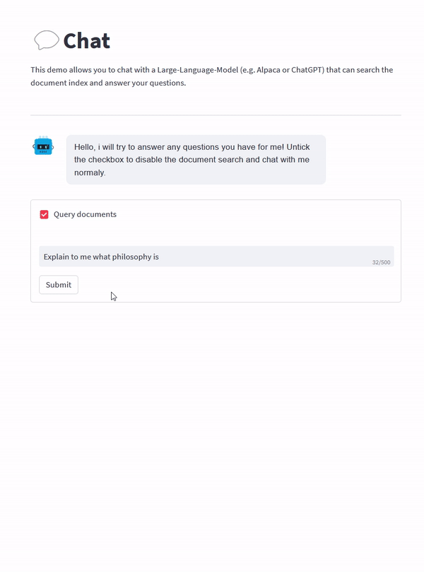
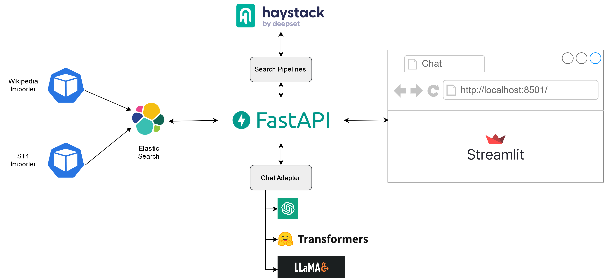

# Retrieval-Augmented-QA-Demo
Query, ask and chat with a document-index via a friendly web ui!

A demo is hosted [here](https://master-ui.kreudev.dynv6.net/). (Please be gentle to the server, it's literally running on an old laptop 😅) 

    

## Installation

Simply run it via Docker-Compose. An example configuration can be found in the `docker-compose.yml` file.
The UI is then available via http://localhost:8501 and the API-Swagger-Documentation via http://localhost:8001/docs

If you want build it from source just download the repo and use the `docker-compose-src-*.yml` files. 
an example `.env` config can be found  in `.env.example`.

All modules are available as prebuild containers via the [Github container registry](https://github.com/LLukas22?tab=packages&repo_name=Retrieval-Augmented-QA). 

⚠️If you want to use the CPU-Adapter you should probably build the api-container from source as it will build  llama.cpp according to your cpu  instructions!
## Overview
The demo has three main components:
* Streamlit web ui
* FastAPI endpoint, which hosts the models and QA pipelines
* Importers, which import textfiles into the system

    

## Chat Module
The chat module allows the user to either use a LLM to query and summarize retrieved documents from the document index or just chat with the model normaly.
It supports multiple chat adapter which are exposed via a streaming api.
The following libraries are supported:
* OpenAI: Uses the default ChatGPT API.To use this adapter a OpenAI API-Token has to be supplied.
* Huggingface: Supports nearly all LLMs on the Huggingfacehub. Also supports PEFT finetuned models. To run this a GPU needs to be passed to the Container running the API.
* LLaMA.cpp: Can run GGJT converted models like [Alpaca](https://huggingface.co/LLukas22/alpaca-native-7B-4bit-ggjt) on a CPU with relatively low resource usage. Use this adapter if you dont have a GPU. 

## Semantic Search & Extractive QA Module
The semantic search and extractive qa modules use [Haystack](https://haystack.deepset.ai/overview/intro) to query the ElasticSearch database.
Nearly all embedding and QA models on the Huggingfacehub are supported.
By default they will be executed on the CPU as a GPU is commonly allocated to the chat model. 

##  Importer
The importers collect text documents and covert them to Haystack-Documents which are then commited to the database.

### Wiki-Importer
Uses a Wikipedia minidump to populate the database with about 500.000 Wikipedia Articles.

### ST4-Importer
Can be used to import technical documentation which was created via the [Schema ST4](https://www.quanos-content-solutions.com/en/software/schema-st4) software.

##  Settings and Environment
To be able to run this repo on different hardware configurations many settings are configurable via environment variables

### API:

| Environment Variable         | Default                                   | Description                                |
|------------------------------|-------------------------------------------|--------------------------------------------|
| HUGGINGFACE_TOKEN            |                                           | Huggingface token                          |
| ELASTICSEARCH_HOST           | localhost                                 | Elasticsearch host address                 |
| ELASTICSEARCH_PORT           | 9200                                      | Elasticsearch port number                  |
| ELASTICSEARCH_USER           |                                           | Elasticsearch user                         |
| ELASTICSEARCH_PASSWORD       |                                           | Elasticsearch password                     |
| EMBEDDING_DIM                | 384                                       | Embedding dimension                        |
| SIMILARITY                   | cosine                                    | Similarity measure                         |
| EMBEDDING_MODEL              | LLukas22/all-MiniLM-L12-v2-embedding-all  | Embedding model                            |
| EXTRACTIVE_QA_MODEL          | LLukas22/all-MiniLM-L12-v2-qa-en          | Extractive QA model                        |
| USE_GPU                      | False                                     | Use GPU for QA and embedding               |
| USE_8BIT                     | False                                     | Use bits-and-bytes                         |
| CONCURENCY_LIMIT             | 5                                         | Concurrency limit of api                   |
| DEBUG                        | True                                      | Debug mode                                 |
| CHATMODEL                    | CPU                                       | Chat Adapter to use (OPENAI,GPU,CPU)       |
| CHAT_MAX_INPUT_LENGTH        | 2000                                      | Chat max input length                      |
| OPENAI_TOKEN                 | None                                      | OpenAI token                               |
| BASE_CHAT_MODEL              | decapoda-research/llama-7b-hf             | Base chat model                            |
| USE_PEFT                     | True                                      | Use PEFT                                   |
| ADAPTER_CHAT_MODEL           | tloen/alpaca-lora-7b                      | Adapter chat model                         |
| ADAPTER_APPLY_OPTIMIZATIONS  | True                                      | Apply Torch optimizations                  |
| CPU_MODEL_REPO               | LLukas22/alpaca-native-7B-4bit-ggjt       | CPU model repository                       |
| CPU_MODEL_FILENAME           | ggjt-model.bin                            | CPU model filename                         |
| CPU_MODEL_THREADS            | 8                                         | CPU model threads                          |
| CPU_MODEL_KV_16              | True                                      | CPU model use f16 for KV-Store             |
| CPU_MODEL_EMBEDDING          | True                                      | CPU model enable embedding mode            |
| CPU_MODEL_USE_MLOCK          | False                                     | Force CPU Model to stay in RAM             |

### UI:

| Environment Variable      | Default                                                                                                          |
|---------------------------|----------------------------------------------------------------------------------------------------------------------|
| SYSTEM_PROMPT             | The following is a friendly conversation between a human and an AI. The AI is talkative and provides lots of specific details from its context. If the AI does not know the answer to a question, it truthfully says it does not know. \n\n Current Conversation: |
| CHAT_WELCOME_MESSAGE      | Hello, I will try to answer any questions you have for me! Untick the checkbox to disable the document search and chat with me normally. |
| WELCOME_MESSAGE           | This demo was initialized with about 500,000 English Wikipedia articles from April 1st, 2023. Feel free to ask the system about any topic you like. \n\n ⚠️CAUTION: If offline models are used, no safety layers are in place. If you ask the system about an offensive topic, it will answer you, even if the answer is immoral!⚠️ |
| API_HOST                  | localhost |
| API_PORT                  | 8001 |
| ENABLE_ADMIN              | False |

### Wiki-Importer:

| Environment Variable   | Default      | Description                  |
|------------------------|--------------|------------------------------|
| ELASTIC_HOST           | localhost    | Elasticsearch host address   |
| ELASTIC_PORT           | 9200         | Elasticsearch port number    |
| ELASTIC_EMBEDDING_DIM  | 384          | Embedding dimension          |
| CACHE_DIR              | ./importer_cache | Cache directory path     |
| WIKI_URL              | https://dumps.wikimedia.org/simplewiki/20230401/simplewiki-20230401-pages-articles-multistream.xml.bz2 | URL of the Wiki-dump to download    |

### ST4-Importer:
| Environment Variable   | Default      | Description                  |
|------------------------|--------------|------------------------------|
| ELASTIC_HOST           | localhost    | Elasticsearch host address   |
| ELASTIC_PORT           | 9200         | Elasticsearch port number    |
| ELASTIC_EMBEDDING_DIM  | 384          | Embedding dimension          |
| ST4_FOLDER             | ./.st4_files | ST4 files folder path        |
